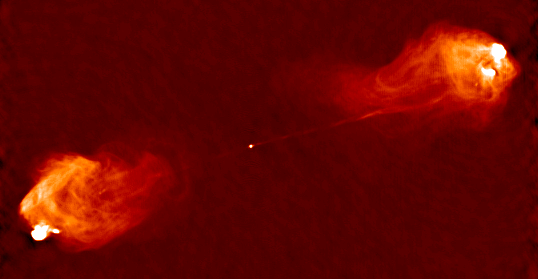

I am interested in high enenrgy astrophysics.
Untill now I have been working on multi frequency tempoarl and spectral analysis of jetted active galactic nuclei (AGN).

## Publications
- **J. Majumdar**, S. Maurya, R. Prince.
  *BL Lacertae under the flare of 2024: Probing temporal and spectral dynamics*.
  _Journal of High Energy Astrophysics_, 48, 100402 (2025).
  [DOI:10.1016/j.jheap.2025.100402](https://doi.org/10.1016/j.jheap.2025.100402)

- **J. Majumdar**, K. Tiwari, A.K. Singh.
  *Multi-instrument study of the response of intense solar flares during the descending period of the 24th solar cycle*.
  _Advances in Space Research_, 76, 371-384 (2025).
  [DOI:10.1016/j.asr.2025.04.063](https://doi.org/10.1016/j.asr.2025.04.063)

- S. Maurya, **J. Majumdar**, Varun, N. Sahu, R. Prince.
  *On the origin of multifrequency temporal and spectral variability in Ton 599*.
  _Publications of the Astronomical Society of Australia_, 42, e053 (2025).
  [DOI:10.1017/pasa.2025.34](https://doi.org/10.1017/pasa.2025.34)
